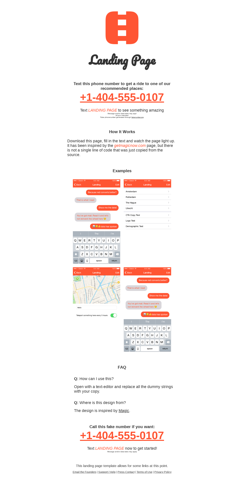
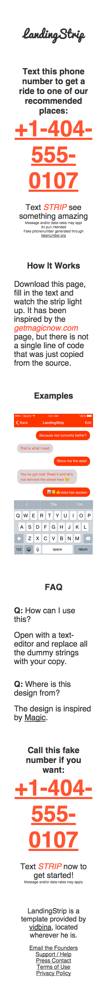

# Enchanted

This template has been based on the [Magic](http://getmagicnow.com) landing
page because they have done so many things right,being keeping things simple
and focusing on the business instead of a web page :wink:.

In the spirit of _learning from the best_, _standing on the shoulders of
giants_ and _going lean_ it is more than sensible to adopt elements that have
worked before.

The [very first][magic-wayback] page of Magic simply allows for the submission
of an e-mail address.

[magic-wayback]: https://web.archive.org/web/20150222041533/http://www.getmagicnow.com/

## Preview

### Desktop

### Mobile

## Usage

- Replace all occurrences of `LandingPage` in `index.html` with your project
  name and modify the remaining copy to your liking.
- Comment out the `.show > ul > li:not(:first-child) { display: none; }` line
  in `main.css` if you want to display all screenshots in the smaller-screen
  version of the page.
- Set the name and logo image inside the `logo` header.
  - Specify the `no-img` logo class if one only wants to present a textual
    logo by hiding the image
  - Specify the `no-text` logo class if one only wants to present the visual
    logo by hiding the textual part
