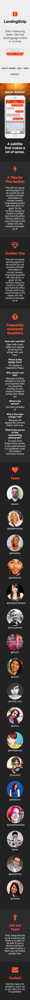

# Joinsupport

This template has been based on [Assist](http://joinassist.com) which was
selected because it just looks pretty (personal opinion so ignore that bit).
Anyways, I needed to setup a landing page that looked somewhat like that and
I'm not redoing that work again when I need something similar in the future.

## Preview

On larger displays, the left pane containing the main call to action and
navigation links appears fixed in frame while the right pane contains some
extra information.

On smaller displays, the fixed pane changes into a header section which. It
appears first because it contains the call to action and the navigation links.

## Usage

- Replace all occurrences of `LandingPage` in `index.html` with your project
  name and modify the remaining copy to your liking.
- Replace the "Placeholder" and "CTA" texts for whatever your situation warrants
