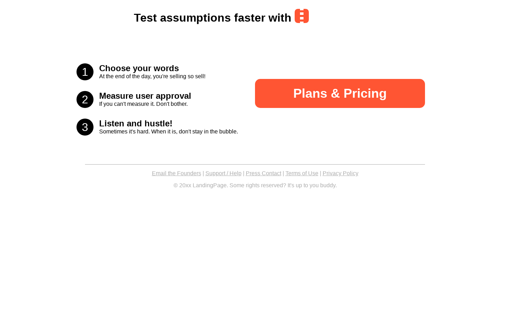
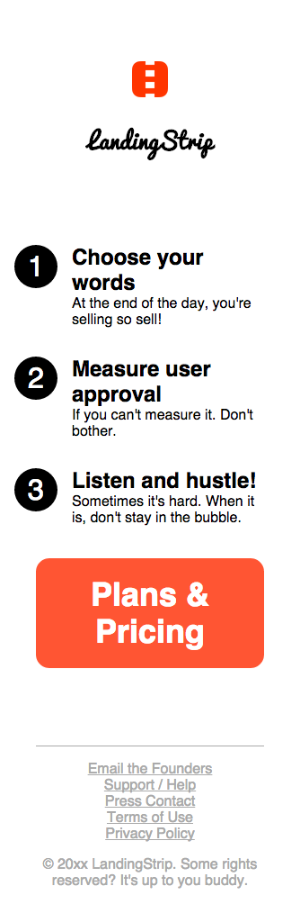

# Pipeline

This landing page has been based on [Buffer][buffer-wayback] which was quite
successful in communication its value proposition and enticing prospects into
reviewing the pricing plans for the service.

[buffer-wayback]: https://web.archive.org/web/20101023092658/http://bufferapp.com/

## Preview

### Desktop

### Mobile

## Usage

- Replace all occurrences of `LandingPage` in `index.html` with your project
  name and modify the remaining copy to your liking.
- Set the link for the _call-to-action_.
